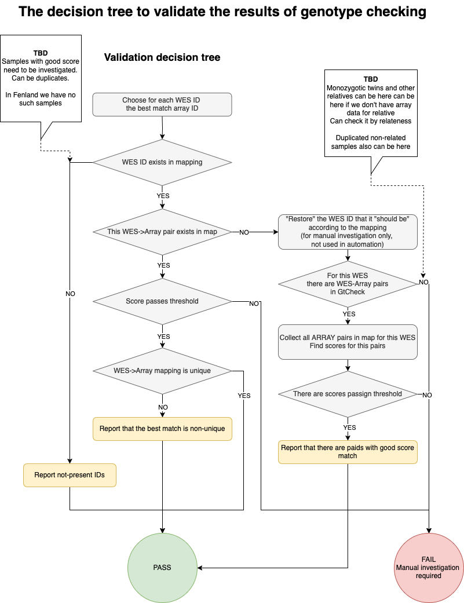

# Getting Started With WES QC Using Hail

This guide covers WES QC using Hail. It is important to note that every dataset is different and that for best results it is not advisable to view this guide as a recipe for QC.
Each dataset will require careful tailoring and evaluation of the QC for best results.

## Before you start

In order to run through this guide you will need an OpenStack cluster with Hail and Spark installed.
It is recommended that you use `osdataproc` to create it.
Follow the [Hail on SPARK](hail-on-spark.md) guide to create such a cluster.

The ability to run WEQ-QC code on a local machine is under development.

This guide also requires a WES dataset joint called with GATK and saved as a set of multi-sample VCFs.
If starting with a Hail matrixtable, then start at [Step 2](#2-sample-qc).

## Set up

### Set up the codebase

Clone the repository using:
```shell
git clone https://github.com/wtsi-hgi/wes-qc.git
cd wes_qc
```

If you are running the code on a local machine (not on the Hail cluster),
set up virtual environment using `uv`.

```bash
pip install uv # Install uv using your default Python interpreter
uv sync # install all required packages
```

Activate your virtual environment
```bash
source .venv/bin/activate
```

**Note**: Alternatively, you can work without activated virtual environment.
In this case you need to use `uv run` for each command.
For example, to run tests: `uv run make integration-test`.

### Create the folder for your data

The default settings in config file assume that all your data and analysis results
will be stored in a specific folder.

Create the folder (ideally, giving to it a meaningful name connected to the name of your dataset).
Create the following subfolders inside it:
* `annotations` - various table reports generated by the pipeline
* `matrixtables` - Hail matrixtables used for data processing
* `metadata` - all metadata for your dataset: self-reported sex, self-reported ethnicity, etc
* `plots` - plots generated by the pipeline
* `resources` - set of resource data
* `training_sets` - set of true-positive variants to train a random forest model.
* `tmp` - temporary data folder
* `variant_qc_random_forest`
* `vcf_afterqc_export` - for exporting final VCFs after QC

Create a folder and place in it your input pre-QC VCFs.

### Obtain resource files

The WES-QC pipeline uses a set of resource data.
This section has a brief description of these resources
and how to obtain it.

#### 1000 Genomes
Currently, gathering the 1000G data for population clustering is a manual process
(automation is being developed).
This process is described in detail in the separate document:
[Prepare resource data](wes-qc-prepare-resources.md)

Briefly, you need to do the following:

1. Download per-chromosome 1000G dataset. HGI uses release taken from here:
   ftp://ftp.1000genomes.ebi.ac.uk/vol1/ftp/data_collections/1000G_2504_high_coverage/working/20220422_3202_phased_SNV_INDEL_SV/
2. (Optional) - run BCFTools to remove structural variations and keep only SNVs and small indels
3. Put the data in the folder specified under `onekg_resource_dir` in the `general` config section (see below).

#### Other resources

The easiest way to obtain training set data and other resources is to run any integration test.
The testing code automatically downloads all training set matrixtables.

To do it:

* Upload wes_qc code to your computation environment
* Run a short integration test using the provided Makefile:
  `make test-it-one-step test=test_trios_1_1`
  **Note:** - the training set data include very big (about 90Gb) gnomAD matrixtable,
  so downloading resources can take up to 6-10 hours depending on your connection speed.

After running the test, in the `wes_qc` code folder you'll have the folder
`tests/test_data`. Copy or symlink the
`resources` and `training_sets` folders to your data analysis folder.

**Note:** this folder is also a good example for different metadata files and their formats.

_The `resources` folder also contains a small subset of 1000-Genomes data.
However, this set is test-only, and for production run
you should download the full-sized 1000-Genomes dataset._

#### Resource data description:

* `igsr_samples.tsv` -- known superpopulations for 1000 genomes dataset.
* `long_ld_regions.hg38.bed` -- BED file containing long-range linkage disequilibrium regions for the genome version hg38
  The regions were obtained from the file `high-LD-regions-hg38-GRCh38.bed` in **plinkQC** github repo:
  (https://github.com/cran/plinkQC/blob/master/inst/extdata/high-LD-regions-hg38-GRCh38.bed).
  These coordinates are results of `liftOver` transferring original coordinates from the genome version hg36 to hg38.
  Original coordinates are provided in supplementary files of the article
  **Anderson, Carl A., et al. "Data quality control in genetic case-control association studies."
  Nature protocols 5.9 (2010): 1564-1573. DOI: 10.1038/nprot.2010.116**
* `HG001_GRCh38_benchmark.interval.illumina.vcf.gz` -- High-confidence variations for GIAB HG001 sample
* `HG001_GRCh38_benchmark.all.interval.illumina.vep.info.txt` - VEP annotations for GIAB HG001 sample
* `1000G_phase1.snps.high_confidence.hg38.ht`, `1000G_omni2.5.hg38.ht`,
  `hapmap_3.3.hg38.ht`, `Mills_and_1000G_gold_standard.indels.hg38.ht` - set of high-confident variations in Hail table format

### Make the config file for your dataset

Create a new config file for your dataset.
By default, all scripts will use the config file named `inputs.yaml`.
You can make a symlink for it to keep the config name meaningful.

```shell
cd config
cp public-dataset.yaml my_project.yaml
ln -snf my_project.yaml inputs.yaml
cd ..
```

Edit `config/my_project.yaml` to include the correct paths for your datasets and working directories.

The WES-QC config file is a YAML file with the ability to reference one field from another.
See the config file caption for details.

Here is the list of fields that you need to modify to start processing your data:
* In the `general` section
  * `data_root` and `dataset_name` specifying the name of your dataset and path to it.
    By default, `data_root` variable contains reference to the dataset name, but you can use file path if you want.
  * `tmp_dir` by default references to the local folder `tmp` inside your dataset folder.
    You can change
  * `onekg_resource_dir`: The place for the 1000-Genome VCFs.
    By default, it is `resources/mini_1000G` field under your data root
  * `rf_model_id` leave it empty for now and specify after creating the random forest model
    during the VariantQC stage
* `step0 -> indir` and `step0 -> kg_pop_file` the directory for the 1000G genomes sample data. See below how to obtain it.

All other files and resources you need are described in the corresponding sections
of this manual.

If you have to make any dataset-specific operations, you can create your own branch
and add all the code you need to it.

## How to run the code

### Manually running the code on a local machine

To manually run the code on a local machine,
run the Python and provide the path to the pipeline script:

```shell
python 1-import_data/1-import_gatk_vcfs_to_hail.py
```

### Manually running the code on a Hail cluster

To submit the jobs on a Hai cluster, you need to set up environment variables
to include the directory you originally cloned the git repo into.
To get a correct Python path, you need to have the virtual environment activated.

```shell
export PYTHONPATH=$PYTHONPATH:$(pwd)
export PYSPARK_PYTHON=$(which python)
export PYSPARK_DRIVER_PYTHON=$(which python)
```

No you can run the pipeline script via `spark-submit`.
For example:

```shell
spark-submit 1-import_data/1-import_gatk_vcfs_to_hail.py
```

We suggest running all code on a cluster in `tmux`/`screen` session to avoid
script termintaion in case of any network issues.


### Automatically syncing and running the code on the cluster from a local machine

If you want to modify the code on your local machine,
and then run it on the cluster, you can use two scripts provided
in the `scripts` folder.

* `hlrun_local` - runs the Python script via `spark-submit`. You need to run it on the spark master node on your cluster.
* `hlrun_remote` - runs the code on the Spark cluster form your local machine.
  It performs a series of operations:
  * Sync the codebase to the remote cluster, defined by the environment variable `$hail_cluster`.
    The variable can contain the full host definition (`user@hostname`) or only hostname from the SSH config file.
  * Create tmux session on the remoter cluster
  * Run the Python script via `hlrun_local`
  * Attach to the tmux session to monitor the progress

**Warning**

The `hlrun_remote` is designed to work with only one tmux session.
To start a new task via `hlrun_remote`, first end the existing tmux session, if it exists.


### Running the code via Jupyter notebook

You can run the code in the provided Jupyter notebook
where all the steps are arranged in a sequence and divided into sections
(e.g. 0-resource_preparation, 1-import_data, 2-sample_qc, 3-variant_qc, 4-genotype_qc).

The notebook is located as `scripts/run-wes-qc-pipeline-all-steps.ipynb`.

It uses `hlrun_local` to run the code, which will output the log file to the current directory,
with the prefix of the step name, e.g. `hlrun_3-1-generate-truth-sets_20250102_125729.log`.

For details, refer to the Markdown comments in the notebook.


## Analyze your data

### 0. Resource Preparation
All steps in this section need to be run only once before your first run. It prepares the reference dataset for the subsequent steps.

1. **Create the 1000G population prediction resource set**.

This resource set is required for the super-population prediction on the population PCA step.
Then you can reuse it with any data cohort.

```shell
spark-submit 0-resource_preparation/1-import_1kg.py --all
```

2. **Create the combined Truth Set table**

Run this step to combine all available variation resources (1000 Genomes, Mills, Hapmap, etc)
into a single table of truth variants.
You need to run this step only once and then reuse the resulting table for all your analysis.

```shell
spark-submit 0-resource_preparation/2-generate-truthset-ht.py
```


### 1. Load data

1. **Load VCFs into Hail and save as a Hail MatrixTable**

Specify in the config file under the `step1 -> gatk_vcf_indir` data entry
the path to the directory that you created for pre-QC VCFs.

Run data import:

```shell
spark-submit 1-import_data/1-import_gatk_vcfs_to_hail.py
```

2. **Annotate metadata**

This script annotates samples with all provided metadata:
VerifyBamId Freemix score, self-reported sex, self-reported ethnicity, etc.

Specify the corresponding input file in the config for each available annotation
(follow the links to download the sample files):

* [verifybamid_selfsm:](https://wes-qc-data.cog.sanger.ac.uk/metadata/control_set_small.verify_bam_id_result.selfSM.tsv) -
  the VerifyBamID Freemix data.
  To prepare this file, join together results of the individual VerifyBamID runs.
* [sex_metadata_file:](https://wes-qc-data.cog.sanger.ac.uk/metadata/mlwh_sample_and_sex.txt) - self-reported sex.
  A tab-separated TSV file, having at least two columns: `sample_id` and `self_reported_sex`.
  The `sample_id` column contains IDs of your samples (same as in your input VCFs).
  The `self_reported_sex` contains sex definition: `female`, `male` or `undefined`.

If you don't have some (or even any) of these annotations,
put `null` instead of the filename in the config file.

You can find examples of metadata files
in the `tests/test_data/metadata` folder created on the [Obtain resource files](#obtain-resource-files) step.

Run the annotation script:

```shell
spark-submit 1-import_data/2-import_annotations.py
```

For each available annotation, the script prints out the list of samples that don't have annotations.
For the Freemix score it performs validation and saves the Freemix plot.

3. **Annotate and validate GtCheck results**

The good practice for clinical samples is to make independent microarray-based genotyping
together with the exome/genome sequencing.
If you have array data, you can use `bcftools gtcheck` utility to check consistency between
sequencing and microarray genotypes.

**Skipping genotype checking**: If you don't have array data, set the `wes_microarray_mapping: none`
under the `validate_gtcheck` section of the config file.
To generate the correct output matrixtable,
you need to run this script in any case, even if you don't have any array data.

To run genotype validation, you need to provide the following files in the config
(open links to obtain the sample files):

* [wes_microarray_mapping:](https://wes-qc-data.cog.sanger.ac.uk/metadata/control_set_small.microarray_mapping.tsv):
  -- the two-column tab-separated file,
  containing the expected mapping between WES and microarray samples.
  (usually, microarray studies have separated sample-preparation protocol and separate IDS)
* [microarray_ids:](https://wes-qc-data.cog.sanger.ac.uk/metadata/control_set_small.microarray_samples.txt)
  -- the list (one ID per line) of IDs, actually found in your microarray data.
  This file is expected to have the same set of IDs as in the mapping file.
  However, sometimes array ganotyping for a particular sample fails,
  and in this case it is not present in the results.
* [gtcheck_report:](https://wes-qc-data.cog.sanger.ac.uk/metadata/control_set_small.combined.gtcheck.txt)
  -- the output of the `bcftools gtcheck` command.
  You need to remove the file header and keep only data lines.

**Note:** To run `bcftools gtcheck` and generate the report,
you most probably need to convert microarray data from FAM to VCF,
and liftover it to the GRCh38 reference.
This work should be done outside WES-QC pipeline,
and is not covered by this manual.

Run the validation script:

```shell
spark-submit 1-import_data/3-validate-gtcheck.py
```

**Gtcheck validation results and interpretation**:

The validation script implements complicated logic to ensure correctness of all data.

At first, it validates the consistency of the mapping file and samples present in the data.
The script reports the IDs present in the mapping but not present in the real data, and opposite.
Also, it returns all duplicated IDs in the mapping.
After validation, the script removes from the mapping table all microarray IDs not found in the data.

Next, the script loads gtcheck table and runs a decision tree to split samples into passed and failed.



On each decision tree step, samples are marked by the specific tag in the `validation_tags` column.

The script exports the final table for all samples, and a separate file for the samples failed validation
under the gtcheck validation dir (specified in the config file in `gtcheck_results_folder` entry).
The tags in the `validation_tags` column allows tracking the chain of decisions for each sample.
The same mechanism allows developers to extend this script and add more decision steps if needed.

Here are all already implemented tags:

| tags                                                         | Description                                                                                                              |
|--------------------------------------------------------------|--------------------------------------------------------------------------------------------------------------------------|
| best_match_exist_in_mapfile, best_match_not_exist_in_mapfile | The matching gtcheck sample with the best score exists/not exists in mapping                                             |
| best_match_matched_mapfile, best_match_not_matched_mapfile   | The matching gtcheck sample with the best score is consistent/not consistent with the mapping file                       |
| score_passed,  score_failed                                  | Gtcheck score for the best matched sample passed/failed threshold check                                                  |
| mapfile_unique, mapfile_non_unique,                          | The matching array sample is unique/not unique in the mapping file                                                       |
| mapfile_pairs_have_gtcheck, no_mapfile_pairs_have_gtcheck    | There is at least one/there are no samples form the mapping file that were reported in the Gtcheck best matching samples |


4. **Plot mutations spectra**

Plotting the mutation spectra can help you to identify batch-level artifacts.
To do it, run the calculation script:

```shell
spark-submit 1-import_data/4-mutation-spectra_preqc.py
```

The script saves the plot in the html file specified under the
`plot_mutation_spectra_preqc`:`mut_spectra_path` config section.
Also, you can specify the IQR range for outliers and change the plot size if needed.


### 2. Sample QC

1. **Run sex imputation**

```shell
spark-submit 2-sample_qc/1-hard_filters_sex_annotation.py
```

The script imputes genetic sex for all samples, and saves the results in the
`sex_annotated.sex_check.tsv.bgz` table in the annotation folder.
Then the script identifies F-stat outliers, and saves it in the
`sex_annotation_f_stat_outliers.tsv` table.
Finally, if self-reported sex is available, the script identifies samples that have
a conflict between self-reported sex and genetically imputed sex, and saves it in the table
`conflicting_sex.tsv`.


2. **Identify samples from related individuals with PCRelate**
This step outputs a relatedness graph, a table of total statistics of relatedness and a list of related samples.
Please see config files "prune_pc_relate" for more details.

```shell
spark-submit 2-sample_qc/2-prune_related_samples.py
```

While this step identifies related samples, we keep them in the dataset since step 2.3 uses PCA score projection for population clustering. The relatedness information can be used to validate pedigree data and detect sample mislabeling.


3. **Predict populations**

Merge 1kg MatrixTable with WES MatrixTable and make LD pruning.

```shell
spark-submit 2-sample_qc/3-population_pca_prediction.py --merge-and-ldprune
```

Run PCA.

```shell
spark-submit 2-sample_qc/3-population_pca_prediction.py --pca
```

Plot 1KG PCA. On this step, all dataset samples should be labelled as `N/A`.

```shell
spark-submit 2-sample_qc/3-population_pca_prediction.py --pca-plot
```

Run population prediction.

```shell
spark-submit 2-sample_qc/3-population_pca_prediction.py --assign_pops
```

Plot PCA clustering for merged dataset (1000 genomes + the dataset), and for the dataset only.
You can specify the number of PCA components you want in the config file.

```shell
spark-submit 2-sample_qc/3-population_pca_prediction.py --pca-plot-assigned
```

4. Identify outliers

Now that we have the predicted populations that each sample belongs to,
we run sample QC stratified by population and identify outliers.

We test the following metrics, calculated by Hail:
* number of SNPs
* heterozygosity rate, heterozygous/homozygous ratio
* number of transitions and transversions, transition/transversion ratio.
* number of deletions and insertions, insertion/deletion ratе

For metric description, see the
[Hail sample_qc()](https://hail.is/docs/0.2/methods/genetics.html#hail.methods.sample_qc)
function description.

```shell
spark-submit 2-sample_qc/4-find_population_outliers.py
```

WES-QC pipeline identifies outliers using the gnomAD function
[`compute_stratified_metrics_filter()`](https://broadinstitute.github.io/gnomad_methods/api_reference/sample_qc/filtering.html#gnomad.sample_qc.filtering.compute_stratified_metrics_filter).
By default, this function designates as outliers any samples
that deviate more than 4 Median Absolute Deviations (MAD)
from the average by any metric.

If you need to adjust this behavior,
modify the `compute_stratified_metrics_filter_args` section in the configuration file.
Any parameters added to this section are transferred to the `compute_stratified_metrics_filter()` function.
For example, you can use the `metric_threshold` dictionary to specify individual thresholds for some metrics.

The script outputs the full list of samples with calculated metrics
(the `stratified_sample_qc`:`output_text_file` config parameter),
statistics, and outlier intervals for all metrics in JSON format
(the `stratified_sample_qc`:`output_globals_json_file` config parameter).

The script plots distribution histograms for all metrics, and
saves them in the folder defined by the `plot_sample_qc_metrics`:`plot_outdir`
config parameter (a set of individual plots and one combined plot for all metrics and populations).
To change default number of bins, use the `n_bins` config parameter.

5. **Filter out samples which fail QC**

The final step in sample QC is filtering the data to remove samples which are identified as failing in the previous script.
<!At this stage samples failing on FREEMIX score and on identity checks are also removed.
This samples should be in files in the annotations directory: `verify_bam_id_result_concat.selfSM`
lists sample ID and FREEMIX score and `sanger_samples_excluded_after_gtcheck.txt` lists samples failing identity checks.
If no samples fail identify checks the latter file could be empty.
> These samples are saved in `samples_failing_qc.tsv.bgz` in the annotation directory.

```shell
spark-submit 2-sample_qc/5-filter_fail_sample_qc.py
```

### 3. Variant QC

The VariantQC steps trains and runs a random forest model to estimate variation quality
and rank all variations by this estimation.

To train the predicting model, we need a set of True-Positive (TP) and False-positive (FP) variations.
Because for a new dataset we don't have the real TP and FP, we use the following approach:

* For likely-true-positive variants, we use all variations that were found and reported
  in public databases: 1000 genomes, HapMap, Mills, etc (see the full list of sources on the step 0.2)
* For likely-false-positive variants, we use variants with the lowest quality scores, provided py the variant caller.

In this documentation the TP and FP abbreviations stand for likely-true-positive and likely-false-positive.

Variant QC uses the optional pedigree file detailing trios existing in the dataset.
The file should follow the [FAM file](https://www.cog-genomics.org/plink/1.9/formats#fam)
notation from PLINK utility.
This is an unheaded, tab-delimited file that contains the following columns:
- Family ID
- Proband ID
- Paternal ID
- Maternal ID
- Proband sex (1-male, 2-female, 0-unknown)
- Proband affected status (0 or 1)

If you don't have pedigree data, several sub-steps will be skipped, and some metrics
for the final graphs won't be calculated.

The first step of variant QC is to split multi-allelic variants and annotate it with family statistics.

```shell
spark-submit 3-variant_qc/1-split_and_family_annotate.py --all
```

Next, an input table is generated to run the random forest on.

```shell
spark-submit 3-variant_qc/2-create_rf_ht.py
```

Next, train the random forest model.

```shell
spark-submit  3-variant_qc/3-train_rf.py
```

The random forest model ID (called _runhash_ previously, so you can find this term in the code)
will be printed to STDOUT.
It is an 8-character string consisting of letters and numbers.
Put this ID in the config file in the `rf_model_id:` parameter under the `general` section.

You can specify the model ID manually using the command line argument `--manual-model-id`.

**Note:**
In old _gnomAD_ releases, the function `train_rf_model()`
could work incorrectly in the parallel SPARK environment.
If and VariantQC step fails with some weird message
(no space left on the device, wrong imports, etc),
try running model training on the master node only by adding `--master local[*]`
to the `spark-submit` parameters.

Now apply the random forest to the entire dataset.

```shell
spark-submit 3-variant_qc/4-apply_rf.py
```

Annotate the random forest output with metrics including synonymous variants, family annotation,
transmitted/untransmitted singletons, and gnomAD allele frequency.
Synonymous variants are required in a file generated from VEP annotation and in the following format:

```
chr10   100202145   rs200461553 T   G   synonymous_variant
chr10   100204510   rs2862988   C   T   synonymous_variant
chr10   100204528   rs374991603 G   A   synonymous_variant
chr10   100204555   rs17880383  G   A   synonymous_variant
```

```shell
spark-submit 3-variant_qc/5-annotate_ht_after_rf.py
```

Add ranks to variants based on random forest score, and bin the variants based on this.

```shell
spark-submit 3-variant_qc/6-rank_and_bin.py
```

Create plots of the binned random forest output to use in the selection of thresholds. Separate thresholds are used for SNPs and indels.

```shell
spark-submit 3-variant_qc/7-plot_rf_output.py
```

The Variant QC is always a trading between sensitivity and quality.
Examine the plots and choose the near-optimal region for RF bin,
that preserves as many TP variants as possible and at the same time eliminating most part of FP variants.
You can refer to other graphs to ensure that the chosen region anso has the expected metrics

At the GenotypeQC step we run the evaluation of different hardfilter combinations
that allows you to improve the results.
Therefore, at this point you don't need to make a final decision.
You only need to choose a provisional RF bin interval to analyze it on the next steps.

However, if you want, you can calculate the number of true positive and false positive variants
remaining at your chosen thresholds using the optional scripts
(where `snv_bin` and `indel_bin` are the thresholds selected for SNVs and indels respectively).
This scripts uses only RF bin filtering and runs faster than the full hardfilter evaluation.

```shell
spark-submit 3-variant_qc/8-select_thresholds.py --snv snv_bin --indel indel_bin
```

If you want to manually explore remaining variations,
you can filter the variants in the Hail MatrixTable based on the selected threshold for SNVs and indels.

```shell
spark-submit 3-variant_qc/9-filter_mt_after_variant_qc.py --snv snv_bin --indel indel_bin
```

### 4. Genotype QC

On the GenotypeQc step we need to remove genotypes that are not quality enough.
However, by removing genotypes that don't match certain filter thresholds,
we always remove some percentage of real existing genotypes.

To obtain good results, we need to determine the best combination of hard filters,
to save "good" variations as much as possible,
and get rid of all "bad" variants and genotypes at the same time.

The first script of the genotype QC helps you to analyze different combinations of hard filters
and choose optimal values.

First hard filter that we use, if the random forest bin,
determined on the VariantQC step.
This filter applies on the variation level, removing
all genotyped for the variation above the threshold
(for RFB bin smaller values are better)

Based on the results of the VariantQC step populate the provisional values
for the SNV and indel random forest bins in the `evaluation` part of the config file.
For example:

```yaml
    snp_bins: [ 60, 75, 90 ]
    indel_bins: [ 25, 50, 75 ]
```

On the genotype level, we use the set of per-genotype hardfilters:
Genotype quality (gq), read depth (dp), and allele balance (ab).
Finally, we calculate missingness (also can be found in the code as **call rate**) —
the minimal percentage of genotypes where this variation remains defined
after applying per-genotype hard filters. This filter also applies on the variant-level.

For all these parameters, you can start with the following default values:

```yaml
    gq_vals: [ 10, 15 ]
    dp_vals: [ 5, 10 ]
    ab_vals: [ 0.2, 0.3 ]
    missing_vals: [0.0, 0.5]
```

If your dataset contains a control sample with known high-confident variations
(usually one of the [GIAB](https://www.nist.gov/programs-projects/genome-bottle) samples),
you can use it to calculate precision/recall values.
Add the sample control name, the corresponding VCF file, and the VEP annotation to the config:

```yaml
    giab_vcf: '{resdir}/HG001_GRCh38_benchmark.interval.illumina.vcf.gz'
    giab_cqfile: '{resdir}/all.interval.illumina.vep.info.txt'
    giab_sample: 'NA12878.alt_bwamem_GRCh38DH.20120826.exome'
```

Data files for the `GIAB HG001/NA12878` sample are available in the resource data
downloaded by the testing script
(see the [Obtain resource files](#obtain-resource-files) section).

_Note_: For now, you still have to specify the correct GIAB VCF and cqfile,
even if you're skipping the precision calculation.

If you don't have a GIAB sample, put `null` in the `giab_sample` section.
The precision/recall calculations will be skipped in this case.

Run the hard-filter evaluation step:

```shell
spark-submit 4-genotype_qc/1-compare_hard_filter_combinations.py --all
```

The script calculates all possible combinations of hard filters.
Depending on the dataset size and number of evaluated combinations, the calculation can take significant time.
The script prints elapsed time and estimated time to complete after each step.

After finishing the calculations, the script
makes interactive plots in the `plot` directory with the `hard_filter_evaluation` prefix.
Also, the script saves results in the subfolder in `annotation` folder, named by the RF model ID.

**At this step, you MUST review and analyze the results to choose correct values for hardfilter combinations**.
The values for the public datasets are not suitable for your data.
Choosing the correct combination requires professional knowledge and could be tricky.
For more detailed explanation of this process you could review some relevant publications,
(for example https://pmc.ncbi.nlm.nih.gov/articles/PMC11747307/).

**Evaluation step outputs:**
For each hardfilter combination, the script calculates the following metrics:
* Percentage of likely-true-positives (TP) and likely-false-positives (FP) variants
  (see the explanation above in the the VariantQC step description).
* Precision and Recall, calculated on the GIAB sample (if it is present in the data).
  For GIAB sample, we can calculate the real true-positive, false-positive, and false-negative variations.
  Therefore, we assume these data as more confident for choosing the optimal hardfilter evaluation
  The TP/FP values should be generally consistent with precision/recall.
  If the GIAB sample is not available, the script outputs -1.0 both for precision and recall
  * For Indels, the script additionally calculates the precision/recall values separately for in-frame and frameshift indels.
* If trios are available, the script also calculates the following values (if trios are not available, script outputs -1):
  * Transmitted/untransmitted SNV ratio — the ration of transmitted/untransmitted singleton variants across trio. Should be close to 1
  * The rate of mendelian errors: variations where the child's genotype does not match any of the possible expected combinations based on the parents' genotypes.

For these data, the script makes the following set of plots:
* FP vs TP
* recall vs precision
* transmitted/untransmitted ratio vs TP
* Mendelian error rate vs TP.

_Note_: currently, the script outputs all the graphs, even if the corresponding data are not available.
You can ignore graphs for the skipped parameters.

All plots are interactive, and you can use the following options to explode your data:
* Zoom in/out
* Move to a specific location by dragging a graph content.
* Use checkboxes to filter data by `DP`, `GQ` `AB`, and `call_rate` hardfilters.
  This option is especially useful when you select/deselect a checkbox and observe how your data change.
* Use sliders to filter by minimum/maximum bin value.
* Change between several available color maps using the dropdown menu.

If you need to analyze more data points, add required values to the config file and rerun the evaluation.
The evaluation script dumps intermediate results for each filter combination and calculates only new
combinations, so the real calculation time will be smaller than estimated.

If you need to recalculate some combinations, go to the folder with dumped results (`json_dump_folder`)
and manually delete all combinations that you need to re-evaluate.
To rerun all calculations from scratch, delete the dump folder entirely.


Based on the desired balance of true positives vs. false positives
and the desired precision/recall balance, choose the three combinations of filters:
relaxed, medium, and stringent.
Fill in the values in the `apply_hard_filters` part of the config.
If needed, add more values to evaluate in the config and rerun the hard filter evaluation.

2. **Run the Genotype QC with the chosen set of filters:**

Now you can apply your custom thresholds and make variants with corresponding filters.

```shell
spark-submit 4-genotype_qc/2-apply_range_of_hard_filters.py
```

3. **Export the filtered variants to VCF.**
Script 3a tags all variations with the corresponding filter (relaxed, medium, stringent)
removes all variants not passing the relaxed filter, and saves the resulting data to VCF files.

```shell
spark-submit 4-genotype_qc/3a-export_vcfs_range_of_hard_filters.py
```

Alternatively, to export VCFs with only passing stringent hard filter, use the 3b version of the script:

```shell
spark-submit 4-genotype_qc/3b-export_vcfs_stringent_filters.py
```

4. **(Optional) - calculate-per-sample statistics**
If you want to additionally evaluate the filter statistics
(variant counts per consequence per sample and
transmitted/untransmitted ratio of synonymous singletons (if trios are present in the data))
use the following script.
VEP annotation is required for this step in the following format:

```
chr10   100199947   rs367984062 A   C   intron_variant
chr10   100199976   rs774723210 G   A   missense_variant
chr10   100200004   .   C   A   missense_variant
chr10   100200012   rs144642900 C   T   missense_variant
chr1    100200019   .  C    A   stop_gained&splice_region_variant
```

```shell
spark-submit 4-genotype_qc/4-counts_per_sample.py
```

5. **Plot mutations spectra**

After completion of the QC process, run the mutation spectra calculation
and validate that results match the expected distribution.

To do it, run the calculation script:

```shell
spark-submit 4-genotype_qc/5-mutation-spectra_afterqc.py
```

The script saves the plot in the html file specified under the
`plot_mutation_spectra_afterqc`:`mut_spectra_path` config section.
